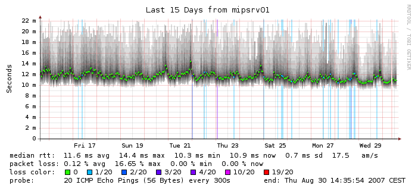

# smokeping via the docker



https://oss.oetiker.ch/smokeping/doc/index.en.html

### Set your target

Update [docker-compose.yaml](docker-compose.yaml) environment variable
to set the destination for your ping tests:

```bash
TARGET: home;some-docker;1.1.1.1
```

### Running

```bash
smokeping    | Smokeping version 2.007003 successfully launched.
smokeping    | Entering multiprocess mode.
smokeping    | Child process 308 started for probe FPing.
smokeping    | FPing: probing 25 targets with step 300 s and offset 10 s.
smokeping    | Child process 309 started for probe DNS.
smokeping    | All probe processes started successfully.
smokeping    | DNS: probing 9 targets with step 300 s and offset 166 s.
```
Run and attach mode:

```bash
docker-compose up -d
```

Running in daemon mode:

```bash
docker-compose up -d
```

Viewing logs:

```bash
docker-compose logs -f smokeping
```

Stopping:

```bash
docker-compose down
```

Check out http://localhost:8888...

### See also

* https://github.com/traviscross/mtr
